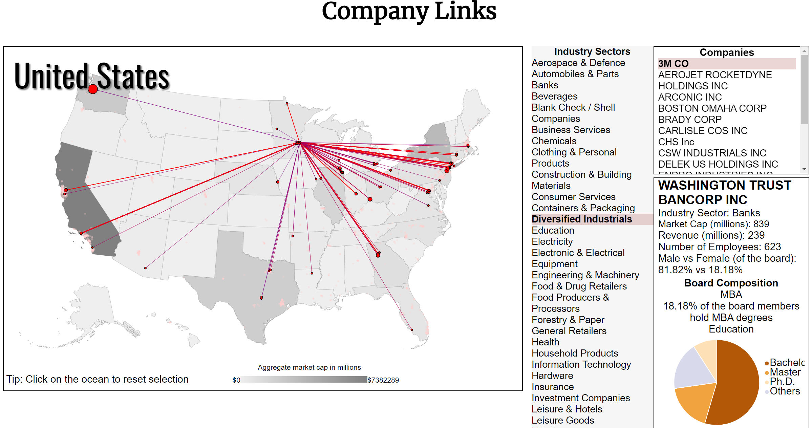
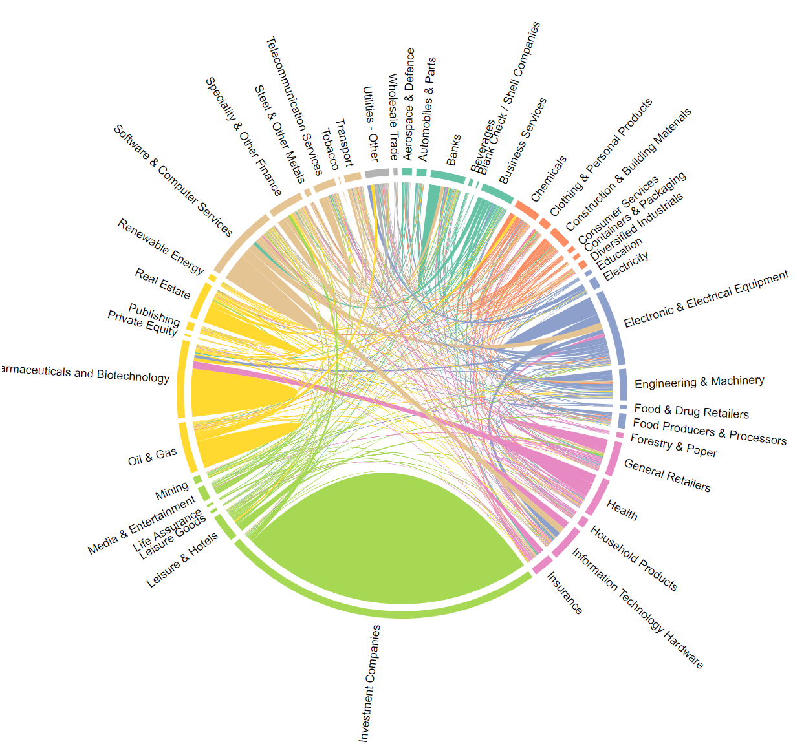

# Overview
This visualization (Company Links) is our project for CS 6630: Visualization for Data Science. For public demo please visit here. We also include a YouTube walkthrough video.

In **Company Link** we try to achieve four things:
- Visualize the **largest 2700+ US companies** (in terms of market capitalization) on the **map**, while enable flexible company browsing by sectors/states.

- Show **links between companies**. We establish a link between any two companies if they share board members.

- Show **detail company profiles**. This inclde market cap, revenue, sector (according to the Financial Times classification), and gender/education/nationality distribution of individual companies.

- Show **links between sectors**. We show this in a chord diagram.

</img>

# Project Folders
- **`welcome.html`** and **`links.html`**. `welcome.html` is the welcome screen, please start our project by clicking on it, which will redirect you to the main visualization after the welcoming/introductory phrases.

- **styles.css** and **welcome.css**. CSS files.

- **js**. Contains all the js scripts to implement our project. Each view (chord/map) has an independent file.

- **data**. Data and figures. The data are in the csv format. All the data processing procedures are in the `firm-link.ipynb` notebook.

- **Sketches**. Sketches of the layout while we're developing.

- **Vis_Project_Proposal**. The proposal of the project.

- **Any external libraries?** We didn't use any external libraries except for the `d3`.

# Team Members
- Alec Nelson
- Yuanyuan Tong
- Yu Zhu
